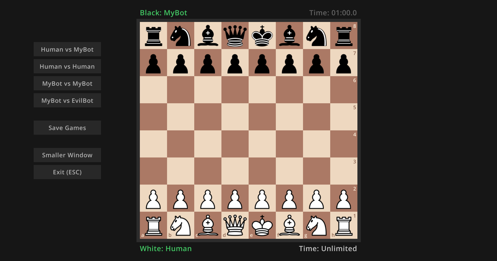
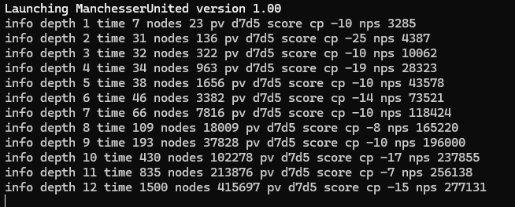
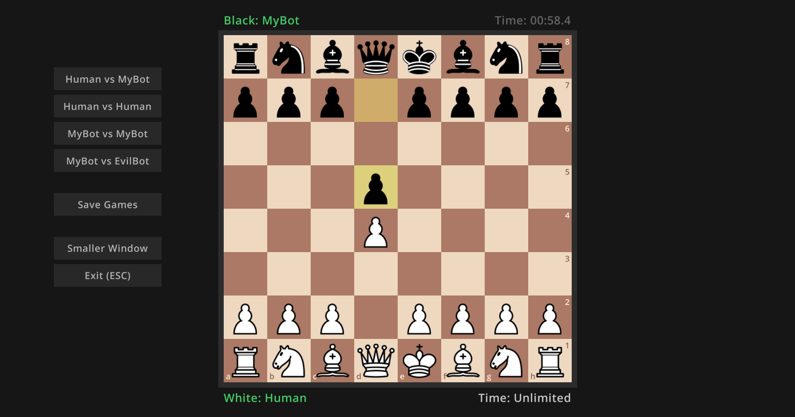

# ♟️ Manchesser United Chess Engine

A high-performance **.NET C# chess engine** designed to simulate intelligent play, analyze moves, and challenge human opponents across multiple difficulty levels.  
Manchesser United blends smart heuristics, search algorithms, and elegant design to bring strategic brilliance to every move.


---


## 🎥 Project Demo

<video controls src="assets/demo.mp4" title="demo.mp4"></video>

---

## 🖼️ Project Screenshots


 ## [Board UI]     

## [Move Evaluation]  
   

## [Engine Output]
 
 

---

## ✨ Features

- ♜ Intelligent AI engine with depth-based search  
- 🧠 Minimax algorithm with Alpha-Beta pruning  
- 💡 Real-time move validation and highlighting  
- 💾 Load and save games using FEN notation  
- ⚙️ Configurable difficulty and search depth  
- 🪶 Optimized using multithreading for faster evaluations  
- 🎨 Optional GUI integration built with WinForms or WPF  

---

## ⚙️ Installation

### Prerequisites

Make sure you have:
- [.NET 8 SDK or newer](https://dotnet.microsoft.com/en-us/download)
- Visual Studio 2022 (or VS Code with C# extension)
- Git

### Steps

```bash
# Clone this repository
git clone https://github.com/mangothecat07/Manchesser-United.git

# Navigate into the project folder
cd Manchesser-United

# Restore dependencies
dotnet restore

# Build the project
dotnet build

# Run the chess engine
dotnet run
